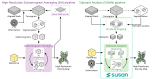
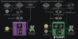

Overview
========

SUSAN (*Substack Analysis*) is an open-source, high-performance framework for
subtomogram averaging (StA) in cryoelectron tomography (CryoET). It
reimplements the full high-resolution StA pipeline using *substacks* (stacks of
2D tilt-series projections and their respective geometric and optical
information) instead of reconstructed 3D subtomograms. A key property of this
formulation is that the 3D cross-correlation is computed exactly from the 2D
projections, with no approximations to the alignment metric. This conceptual
shift reduces computational complexity from :math:`\mathcal{O}(N^3)` to
:math:`\mathcal{O}(N_\text{proj} N^2)`, yielding orders-of-magnitude reductions
in runtime and storage compared with conventional tomogram-centric pipelines,
without sacrificing accuracy.

In practice, this means tomograms serve only for visual inspection and initial
particle picking; the STA problem itself is solved directly against the raw
tilt-series stacks. Substacks are extracted on-the-fly during processing, so
full subtomogram volumes never need to be written to disk, eliminating the
dominant source of storage in conventional pipelines. Achieving this required a
complete reimplementation of the entire pipeline natively in the projection
domain, covering CTF estimation, CTF refinement, 3D/2D alignment, and averaging.

The computational core is implemented in GPU-accelerated **C++/CUDA** and
supports distributed execution via **MPI**. A **Python** (and MATLAB) interface
provides scriptable, high-level control of complete processing pipelines. An
optional machine-learning denoiser (**Noise2Noise**) further stabilises
high-resolution reconstructions within the iterative refinement loop.

SUSAN achieves *state-of-the-art* resolutions across a wide range of datasets,
from purified complexes and viral assemblies to challenging *in situ* samples.
The orders-of-magnitude reduction in computational cost has a direct practical
impact in two directions: problems that previously required large GPU clusters
become tractable on standard academic hardware, and the same hardware budget can
instead be reinvested to scale up to larger datasets, higher-resolution targets,
or more complex multi-reference analyses. This dual flexibility effectively
democratises high-resolution StA, lowering the barrier to entry across the
CryoET community.

Key features at a glance
------------------------

* **Exact 3D cross-correlation**: computed directly from 2D projections via the
  *projected cross-correlation* (pCC) algorithm [sanchez_2019_pcc]_
  [sanchez_2019_alignment]_; no approximation is introduced to the alignment
  metric.
* **Projection-domain pipeline**: all processing steps, including 3D alignment
  and reconstruction, operate on 2D projections; tomograms and subtomograms are
  not required within the iterative refinement loop, only for initial particle
  picking and visual validation.
* **Zero pre-extracted data storage**: no subtomograms or substack-equivalent
  data are written to disk; substacks are cropped on-the-fly from the raw tilt
  series directly into RAM and GPU memory.
* **GPU-accelerated and distributed execution**: all heavy computations are
  performed in 2D on GPU; multi-node parallelism is supported via **MPI**.
* **CTF estimation and refinement**: with a CryoET-specific defocus estimator
  that handles severe defocus gradients in thick *in situ* specimens.
* **Multi-reference alignment and classification** (MRA/MRC): with per-particle
  reference assignment.
* **MAP-like regularisation priors**: configurable Gaussian priors on
  translational offsets, orientational angles, and defocus values constrain the
  alignment and CTF refinement search, stabilising convergence and preventing
  noise-driven parameter drift.
* **MACE framework**: a modular, user-extensible Multi-Agent Consensus
  Equilibrium formulation; the pipeline decomposes into independent,
  interchangeable agents (reconstruction, alignment, 2D refinement, CTF
  refinement, denoising prior) that can be replaced, combined, or scripted
  independently.
* **Noise2Noise**: a lightweight self-supervised denoiser operating on
  half-maps, integrated as the volume-prior agent within the MACE framework.
* **Multiresolution support**: particle metadata is decoupled from tomogram
  geometry, allowing the same particle set to be processed seamlessly at
  multiple binning levels.
* **Minimal external dependencies**: installable as a standard Python package
  alongside existing CryoET environments.

Contributing
------------

SUSAN is hosted on GitHub at https://github.com/rsanchezloayza/SUSAN.

Bug reports and feature requests are welcome via the GitHub issue tracker.
Pull requests should target the ``main`` branch.  Please open an issue first
to discuss any non-trivial change.

License
-------

SUSAN is released under the **GNU Affero General Public License v3.0** (AGPL-3).
You are free to use, modify, and distribute SUSAN under the terms of that
licence.  In particular, if you deploy SUSAN as part of a network service, you
must make the complete source of your modifications available under the same
terms.  See the ``LICENSE`` file in the repository root for the full text.

.. rubric:: References

.. [sanchez_2019_pcc] R. M. Sánchez, R. Mester, and M. Kudryashev,
   "Fast Cross Correlation for Limited Angle Tomographic Data,"
   *Image Analysis*, Lecture Notes in Computer Science, Springer, 2019.
   `DOI: 10.1007/978-3-030-20205-7_34 <https://doi.org/10.1007/978-3-030-20205-7_34>`_

.. [sanchez_2019_alignment] R. M. Sánchez, R. Mester, and M. Kudryashev,
   "Fast Alignment of Limited Angle Tomograms by Projected Cross Correlation,"
   *27th European Signal Processing Conference (EUSIPCO)*, Sep. 2019.
   `DOI: 10.23919/EUSIPCO.2019.8903041 <https://doi.org/10.23919/EUSIPCO.2019.8903041>`_

